# Polyglot Codebase Knowledge Graph

> Generated offline by **readmenator**. Supports C, C++, Python, Go, Rust, JS/TS, Java, C#, Shell, PHP, Dart, GDScript, Nim, ASM.
> No LLMs. No tokens. Pure static analysis.

**Total Files Parsed:** 3 | **Total Symbols Extracted:** 10 | **Total Imports:** 2

## Structural Knowledge Map

```mermaid
graph TD
    classDef mod fill:#1e1e1e,stroke:#ff6666,stroke-width:2px,color:#fff;
    classDef cls fill:#2d2d2d,stroke:#4ec9b0,stroke-width:2px,color:#fff;
    classDef fn fill:#333,stroke:#dcdcaa,stroke-width:1px,color:#dcdcaa;
    classDef ext fill:#111,stroke:#666,stroke-dasharray: 5 5,color:#aaa;
    injector_c["injector.c (c)"]
    class injector_c mod;
    injector_c_get_nt_headers["get_nt_headers"]
    class injector_c_get_nt_headers fn;
    injector_c --> injector_c_get_nt_headers
    injector_c_is_64bit["is_64bit"]
    class injector_c_is_64bit fn;
    injector_c --> injector_c_is_64bit
    injector_c_get_image_size["get_image_size"]
    class injector_c_get_image_size fn;
    injector_c --> injector_c_get_image_size
    injector_c_get_entry_point_rva["get_entry_point_rva"]
    class injector_c_get_entry_point_rva fn;
    injector_c --> injector_c_get_entry_point_rva
    injector_c_pe_buffer_to_virtual_image["pe_buffer_to_virtual_image"]
    class injector_c_pe_buffer_to_virtual_image fn;
    injector_c --> injector_c_pe_buffer_to_virtual_image
    app_py["app.py (py)"]
    class app_py mod;
    install_sh["install.sh (sh)"]
    class install_sh mod;
    ext_windows_h["windows.h"]
    class ext_windows_h ext;
    injector_c -.->|imports| ext_windows_h
    ext_stdio_h["stdio.h"]
    class ext_stdio_h ext;
    injector_c -.->|imports| ext_stdio_h
```

---

## Architecture Reference

### C (1 files)

#### `injector.c`
**Path:** `injector.c`

**Functions:**
- `get_nt_headers` (line 9) - *include <windows.h> include <stdio.h> ==================================================================== PE PARSING HELPERS (REPLACING PECONV) ==...*
- `is_64bit` (line 21) - *Checks if the PE buffer is for a 64-bit executable.*
- `get_image_size` (line 29) - *Gets the SizeOfImage from the PE headers.*
- `get_entry_point_rva` (line 37) - *Gets the RVA of the Entry Point.*
- `pe_buffer_to_virtual_image` (line 45) - *Maps a raw PE file buffer into a virtual layout, similar to how the OS loader would map it.*
- `create_suspended_process` (line 76) - *==================================================================== PROCESS MANIPULATION =========================================================...*
- `update_remote_entry_point` (line 90) - *Updates the Entry Point of the remote process's main thread.*
- `get_remote_image_base` (line 113) - *Gets the base address of the main module in the remote process.*
- `overwrite_and_run` (line 151) - *==================================================================== MEMORY OVERWRITING ===========================================================...*
- `main` (line 189) - *==================================================================== MAIN ====================================================================*

### PY (1 files)

#### `app.py`
**Path:** `app.py`

*No symbols extracted*

### SH (1 files)

#### `install.sh`
**Path:** `install.sh`

*No symbols extracted*
