# Polyglot Codebase Knowledge Graph

> Generated offline by **readmenator**. 3 files, 21 symbols, 2 imports. Supports C, C++, Python, Go, Rust, JS/TS, Java, C#, Shell, PHP, Dart, GDScript, Nim, ASM, Ruby, Swift, Kotlin, Scala, Lua, Elixir.
> No LLMs. No tokens. Pure static analysis. See more [here](https://github.com/grisuno/ReadMenator)

**Start here:** Statistics Dashboard for scope, God Nodes for blast radius, Architecture Reference for per-file API. Agents: prefer `readmenator-agent/INDEX.md` + `SYMBOLS.md`.

**Total Files Parsed:** 3 | **Total Symbols Extracted:** 21 | **Total Imports:** 2

<!-- ranking_model: v1.0 | weights: {ppr:0.45,auth:0.2,test:0.15,doc:0.1,fresh:0.1} | alpha:0.85 | commit:b3ca3bb | date:2026-07-18 -->


## Table of Contents

1. [Statistics Dashboard](#statistics-dashboard)
2. [Architectural Layers](#architectural-layers)
3. [Ranked Context](#ranked-context)
4. [God Nodes](#god-nodes)
5. [Suggested Questions](#suggested-questions)
6. [Hotspot Analysis](#hotspot-analysis)
7. [Change Impact Analysis](#change-impact-analysis)
8. [Suggested Linting Rules](#suggested-linting-rules)
9. [Orphans](#orphans)
10. [Query Recipes](#query-recipes)
11. [Structural Knowledge Map](#structural-knowledge-map)
12. [UML Class Diagram](#uml-class-diagram)
13. [Code Property Graph](#code-property-graph)
14. [Architecture Reference](#architecture-reference)
    - [C (1 files)](#c-1-files)
    - [PY (1 files)](#py-1-files)
    - [SH (1 files)](#sh-1-files)

---

## Statistics Dashboard

| Metric | Value |
|--------|-------|
| Total Files | 3 |
| Total Symbols | 21 |
| Total Imports | 2 |
| Call Edges | 0 |
| Inheritance Edges | 0 |
| Languages | 3 |
| Avg Symbols/File | 7.0 |
| Avg Imports/File | 0.7 |

### Top Files by Import Count (Fan-Out)

| File | Imports | Symbols | Language |
|------|---------|---------|----------|
| `injector.c` | 2 | 21 | c |

---

## Architectural Layers

Auto-detected from path patterns, naming conventions, and imported frameworks.

| Layer | Files |
|-------|-------|
| utility | 2 |
| infrastructure | 1 |

### utility

- `app.py` (py, 0 symbols)
- `install.sh` (sh, 0 symbols)

### infrastructure

- `injector.c` (c, 21 symbols)

---

## Ranked Context

Files ranked by composite score for the current query context. The ranking combines Personalized PageRank (query relevance), global authority, test coverage, documentation coverage, and code freshness. Model: v1.0.

| Rank | File | Composite | PPR | Authority | Test | Doc |
|------|------|-----------|-----|-----------|------|-----|
| 1 | `app.py` | 0.1000 | 0.0000 | 0.0000 | 0.00 | 1.00 |
| 2 | `injector.c` | 0.0619 | 0.0000 | 0.0000 | 0.00 | 0.62 |
| 3 | `install.sh` | 0.0000 | 0.0000 | 0.0000 | 0.00 | 0.00 |

---

## God Nodes

Most architecturally central files ranked by combined import/export degree and symbol richness.

| File | Score | Connections | PageRank |
|------|-------|-------------|----------|
| `injector.c` | 2.1 | | 0.0000 |
| `app.py` | 0.0 | | 0.0000 |
| `install.sh` | 0.0 | | 0.0000 |

---

## Suggested Questions

Auto-generated exploration prompts based on graph structure:

- What does injector.c depend on, and what depends on it? (0 connections)
- What does app.py depend on, and what depends on it? (0 connections)
- What does install.sh depend on, and what depends on it? (0 connections)
- What is the overall architecture of this codebase?

---

## Hotspot Analysis

Files ranked by combined complexity (symbol count) and centrality (connection count). High-scoring files are architecturally critical and may need refactoring attention.

| File | Complexity | Centrality | Combined | Symbols | Connections |
|------|-----------|------------|----------|---------|-------------|
| `app.py` | 0.000 | 0.000 | 0.000 | 0 | 0 |
| `injector.c` | 1.000 | 1.000 | 1.000 | 21 | 2 |
| `install.sh` | 0.000 | 0.000 | 0.000 | 0 | 0 |

---

## Change Impact Analysis

Files sorted by how many other files would be affected if they changed. High-impact files should be changed with caution.

| File | Direct Dependents | Transitive Dependents | Total Impact |
|------|------------------|----------------------|--------------|
| `app.py` | 0 | 0 | 0 |
| `injector.c` | 0 | 0 | 0 |
| `install.sh` | 0 | 0 | 0 |

---

## Suggested Linting Rules

Automatically suggested linting and security rules based on patterns detected in the codebase. These can be exported as Semgrep rules using the `--export-rules` flag.

| Rule ID | Severity | Description | Language | Matches |
|---------|----------|-------------|----------|---------|
| `RM001` | info | Large number of functions in c: 21 total | c | 21 |

---

## Orphans

Files with no documentation or low connectivity. These are candidates for documentation investment or cleanup.

- `install.sh` (0 symbols, no doc)

---

## Query Recipes

Example queries you can run against this knowledge base using the ranking engine:

```
# Find files most relevant to a concept
readmenator query "Where is the import resolver implemented?"

# Rank files by relevance to a topic
readmenator query "How does documentation generation work?"

# Explain why a file ranks highly
readmenator query "explain readmenator/_documentation.py"

# Trace dependency paths with ranked context
readmenator query "path from CLI to exporter"
```

The ranking model uses the following signals:

- **Personalized PageRank** (45% weight): query-specific relevance via seed propagation
- **Global Authority** (20% weight): structural importance via standard PageRank
- **Test Coverage** (15% weight): fraction of symbols referenced in test files
- **Doc Coverage** (10% weight): presence of docstrings and file-level docs
- **Freshness** (10% weight): recent modification activity

Results include score decomposition and justification paths for each ranked item.

---

## Structural Knowledge Map

```mermaid
graph TD
    classDef mod fill:#1e1e1e,stroke:#ff6666,stroke-width:2px,color:#fff;
    classDef cls fill:#2d2d2d,stroke:#4ec9b0,stroke-width:2px,color:#fff;
    classDef fn fill:#333,stroke:#dcdcaa,stroke-width:1px,color:#dcdcaa;
    classDef ext fill:#111,stroke:#666,stroke-dasharray: 5 5,color:#aaa;
    injector_c["injector.c (c)"]
    class injector_c mod;
    injector_c_get_nt_headers["get_nt_headers"]
    class injector_c_get_nt_headers fn;
    injector_c --> injector_c_get_nt_headers
    injector_c_is_64bit["is_64bit"]
    class injector_c_is_64bit fn;
    injector_c --> injector_c_is_64bit
    injector_c_get_image_size["get_image_size"]
    class injector_c_get_image_size fn;
    injector_c --> injector_c_get_image_size
    injector_c_get_entry_point_rva["get_entry_point_rva"]
    class injector_c_get_entry_point_rva fn;
    injector_c --> injector_c_get_entry_point_rva
    injector_c_pe_buffer_to_virtual_image["pe_buffer_to_virtual_image"]
    class injector_c_pe_buffer_to_virtual_image fn;
    injector_c --> injector_c_pe_buffer_to_virtual_image
    app_py["app.py (py)"]
    class app_py mod;
    install_sh["install.sh (sh)"]
    class install_sh mod;
    ext_windows_h["windows.h"]
    class ext_windows_h ext;
    injector_c -.->|imports| ext_windows_h
    ext_stdio_h["stdio.h"]
    class ext_stdio_h ext;
    injector_c -.->|imports| ext_stdio_h
```



---

## Code Property Graph

Machine-readable Code Property Graph (CPG) in JSON-LD format. This block allows AI agents to parse the full structural graph without additional file reads. Compatible with GraphRAG pipelines.

```json
{"@context": "https://schema.org", "analysis": {"communities": [], "god_nodes": [{"node_id": "injector.c", "score": 2.1}, {"node_id": "app.py", "score": 0.0}, {"node_id": "install.sh", "score": 0.0}], "surprising_connections": []}, "edges": [{"confidence": "EXTRACTED", "relation": "imports", "source": "injector.c", "target": "windows.h"}, {"confidence": "EXTRACTED", "relation": "imports", "source": "injector.c", "target": "stdio.h"}], "generator": "readmenator", "metadata": {"edge_count": 2, "file_count": 3, "language_count": 3, "symbol_count": 21}, "nodes": [{"doc": "_*_ coding: utf8 _*_", "id": "app.py", "kind": "module", "label": "app.py", "language": "py", "sha256": "57b21bdb023585b8", "symbol_count": 0, "symbols": []}, {"doc": "include <windows.h> include <stdio.h>  ==================================================================== PE PARSING HELPERS (REPLACING PECONV) ====================================================================  Gets the NT Headers from a raw PE buffer.", "id": "injector.c", "kind": "module", "label": "injector.c", "language": "c", "sha256": "1d64555467be25d9", "symbol_count": 21, "symbols": [{"doc": "Gets the NT Headers from a raw PE buffer.", "kind": "function", "line": 9, "name": "get_nt_headers", "signature": "IMAGE_NT_HEADERS* get_nt_headers(BYTE* buffer)"}, {"doc": "Checks if the PE buffer is for a 64-bit executable.", "kind": "function", "line": 21, "name": "is_64bit", "signature": "BOOL is_64bit(BYTE* buffer)"}, {"doc": "Gets the SizeOfImage from the PE headers.", "kind": "function", "line": 29, "name": "get_image_size", "signature": "DWORD get_image_size(BYTE* buffer)"}, {"doc": "Gets the RVA of the Entry Point.", "kind": "function", "line": 37, "name": "get_entry_point_rva", "signature": "DWORD get_entry_point_rva(BYTE* buffer)"}, {"doc": "Maps a raw PE file buffer into a virtual layout, similar to how the OS loader would map it.", "kind": "function", "line": 45, "name": "pe_buffer_to_virtual_image", "signature": "BYTE* pe_buffer_to_virtual_image(BYTE* raw_buffer, DWORD* out_size)"}, {"doc": "Creates a process in a suspended state.", "kind": "function", "line": 76, "name": "create_suspended_process", "signature": "BOOL create_suspended_process(char* path, PROCESS_INFORMATION* pi)"}, {"doc": "Updates the Entry Point of the remote process's main thread.", "kind": "function", "line": 90, "name": "update_remote_entry_point", "signature": "BOOL update_remote_entry_point(PROCESS_INFORMATION* pi, ULONGLONG entry_point_va, BOOL is_32bit_t..."}, {"doc": "Gets the base address of the main module in the remote process.", "kind": "function", "line": 113, "name": "get_remote_image_base", "signature": "ULONGLONG get_remote_image_base(PROCESS_INFORMATION* pi, BOOL is_32bit_target)"}, {"doc": "Overwrites the remote process's main module with the payload.", "kind": "function", "line": 151, "name": "overwrite_and_run", "signature": "BOOL overwrite_and_run(PROCESS_INFORMATION* pi, BYTE* payload_image, DWORD payload_image_size)"}, {"doc": "==================================================================== MAIN ====================================================================", "kind": "function", "line": 189, "name": "main", "signature": "int main(int argc, char* argv[])"}, {"kind": "function", "line": 14, "name": "printf", "signature": "printf(\"[-] Invalid DOS signature.\\n\");"}, {"doc": "Copy headers", "kind": "function", "line": 58, "name": "memcpy", "signature": "memcpy(virtual_image, raw_buffer, nt_headers->OptionalHeader.SizeOfHeaders);"}, {"kind": "function", "line": 80, "name": "memset", "signature": "memset(pi, 0, sizeof(PROCESS_INFORMATION));"}, {"kind": "function", "line": 98, "name": "Wow64SetThreadContext", "signature": "return Wow64SetThreadContext(pi->hThread, &context);"}, {"doc": "endif", "kind": "function", "line": 109, "name": "SetThreadContext", "signature": "return SetThreadContext(pi->hThread, &context);"}, {"kind": "function", "line": 180, "name": "ResumeThread", "signature": "ResumeThread(pi->hThread);"}, {"kind": "function", "line": 212, "name": "ReadFile", "signature": "ReadFile(h_file, raw_buffer, raw_size, &read, NULL);"}, {"kind": "function", "line": 213, "name": "CloseHandle", "signature": "CloseHandle(h_file);"}, {"kind": "function", "line": 217, "name": "HeapFree", "signature": "HeapFree(GetProcessHeap(), 0, raw_buffer);"}, {"kind": "function", "line": 235, "name": "VirtualFree", "signature": "VirtualFree(payload_image, 0, MEM_RELEASE);"}, {"kind": "function", "line": 281, "name": "TerminateProcess", "signature": "TerminateProcess(pi.hProcess, 1);"}]}, {"id": "install.sh", "kind": "module", "label": "install.sh", "language": "sh", "sha256": "c907d80fd6734993", "symbol_count": 0, "symbols": []}], "type": "CodePropertyGraph", "version": "1.0"}
```

---

## Architecture Reference

### C (1 files)

#### `injector.c`
**Path:** `injector.c`
**File Doc:** *include <windows.h> include <stdio.h>  ==================================================================== PE PARSING HELPERS (REPLACING PECONV) ====================================================================  Gets the NT Headers from a raw PE buffer.*

**Functions:**
- `get_nt_headers` (line 9) `IMAGE_NT_HEADERS* get_nt_headers(BYTE* buffer)` - *Gets the NT Headers from a raw PE buffer.*
- `is_64bit` (line 21) `BOOL is_64bit(BYTE* buffer)` - *Checks if the PE buffer is for a 64-bit executable.*
- `get_image_size` (line 29) `DWORD get_image_size(BYTE* buffer)` - *Gets the SizeOfImage from the PE headers.*
- `get_entry_point_rva` (line 37) `DWORD get_entry_point_rva(BYTE* buffer)` - *Gets the RVA of the Entry Point.*
- `pe_buffer_to_virtual_image` (line 45) `BYTE* pe_buffer_to_virtual_image(BYTE* raw_buffer, DWORD* out_size)` - *Maps a raw PE file buffer into a virtual layout, similar to how the OS loader would map it.*
- `create_suspended_process` (line 76) `BOOL create_suspended_process(char* path, PROCESS_INFORMATION* pi)` - *Creates a process in a suspended state.*
- `update_remote_entry_point` (line 90) `BOOL update_remote_entry_point(PROCESS_INFORMATION* pi, ULONGLONG entry_point_va, BOOL is_32bit_t...` - *Updates the Entry Point of the remote process's main thread.*
- `get_remote_image_base` (line 113) `ULONGLONG get_remote_image_base(PROCESS_INFORMATION* pi, BOOL is_32bit_target)` - *Gets the base address of the main module in the remote process.*
- `overwrite_and_run` (line 151) `BOOL overwrite_and_run(PROCESS_INFORMATION* pi, BYTE* payload_image, DWORD payload_image_size)` - *Overwrites the remote process's main module with the payload.*
- `main` (line 189) `int main(int argc, char* argv[])` - *==================================================================== MAIN ====================================================================*
- `printf` (line 14) `printf("[-] Invalid DOS signature.\n");`
- `memcpy` (line 58) `memcpy(virtual_image, raw_buffer, nt_headers->OptionalHeader.SizeOfHeaders);` - *Copy headers*
- `memset` (line 80) `memset(pi, 0, sizeof(PROCESS_INFORMATION));`
- `Wow64SetThreadContext` (line 98) `return Wow64SetThreadContext(pi->hThread, &context);`
- `SetThreadContext` (line 109) `return SetThreadContext(pi->hThread, &context);` - *endif*
- `ResumeThread` (line 180) `ResumeThread(pi->hThread);`
- `ReadFile` (line 212) `ReadFile(h_file, raw_buffer, raw_size, &read, NULL);`
- `CloseHandle` (line 213) `CloseHandle(h_file);`
- `HeapFree` (line 217) `HeapFree(GetProcessHeap(), 0, raw_buffer);`
- `VirtualFree` (line 235) `VirtualFree(payload_image, 0, MEM_RELEASE);`
- `TerminateProcess` (line 281) `TerminateProcess(pi.hProcess, 1);`

### PY (1 files)

#### `app.py`
**Path:** `app.py`
**File Doc:** *_*_ coding: utf8 _*_*

*No symbols extracted*

### SH (1 files)

#### `install.sh`
**Path:** `install.sh`

*No symbols extracted*
